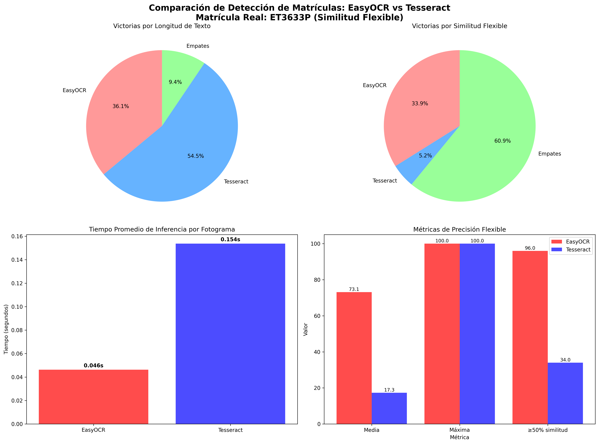

# Prácticas Cuatro y Cinco

### Autores
1. Andrea Santana López

## ¿Qué se va a desarrollar?
En este entregable se van a desarrollar dos prácticas: la primera consiste en un detector de matrículas utilizando YOLO y la segunda parte usaremos un conjunto de modelos propuestos (EasyOCR, Tesseract y PaddleOCR) y los compararemos con sus tiempos de inferencia y rendimiento para saber cuál es el mejor para la detección de matrículas.

## Condiciones para las prácticas
Para la primera práctica se tuvo que desarrollar un entorno nuevo en Anaconda utilizando la versión de Python 3.9.5 e instalar Ultralytics, que es un marco de IA que ofrece implementaciones abiertas de código abierto del algoritmo de detección de objetos YOLO (You Only Look Once) y un paquete llamado LAP (Linear Assignment Problem solver), que es un solucionador rápido para el problema de asignación lineal.

Aquí dejamos los pasos para que pueda ejecutar la práctica:

```sh
conda create --name VC_P4 python=3.9.5
conda activate VC_P4
pip install ultralytics
pip install lap
```

Si no funciona LAP, use lapx:
```sh
pip install lapx
```

Si cuentas con GPU, para hacer uso de su potencia de cálculo en el environment, necesitas contar con CUDA instalado y seguir las instrucciones para contar con todos los paquetes compatibles necesarios. Para la instalación, cuentas con esta guía que te prepara la línea de comando a lanzar. Un ejemplo de la utilizada en mi equipo con CUDA v11.6:

```sh
conda install pytorch==1.12.1 torchvision==0.13.1 torchaudio==0.12.1 cudatoolkit=11.6 -c pytorch -c conda-forge
```

Luego, si quieres instalar EasyOCR, PaddleOCR y Tesseract, tendrás que crear tres entornos virtuales ya que las dependencias de cada uno de ellos pueden dejar de funcionar.

Para EasyOCR:
```sh
pip install easyocr
```

Para Tesseract hay que ir a la página principal y descargar el archivo ejecutable y después ejecutar el siguiente comando:
```sh
pip install pytesseract
```

Para PaddleOCR hay que ejecutar el siguiente comando:
```sh
pip install paddleocr
```

## Controles del usuario
Para parar el video puede usar la tecla ESC o se detendrá automáticamente.

## Desarrollo
Primero hay que importar las librerías para poder detectar y seguir las personas, coches y matrículas.

```python
from ultralytics import YOLO
import numpy as np
import cv2  
import math 
import os
from collections import defaultdict
from roboflow import Roboflow
```

Segundo, empezamos con los apartados pedidos; en primer lugar detectamos personas y coches, por lo que primero definimos el modelo que vamos a usar que es YOLO11n y las clases en un diccionario donde las claves son 0 y 2 y en los valores ponemos a qué clase pertenecen, además declaramos el video que vamos a abrir.

```python
model = YOLO("yolo11n.pt")
classes = {0:"person", 2:"car"}
capture_video = cv2.VideoCapture("video1.mp4")
```

En segundo lugar realizamos un bucle while igual a True para recorrer los frames del video donde declaramos los parámetros ret y frame_video, donde si ret es True significa que ha detectado un frame del video y almacena el frame en el parámetro frame_video.

```python
while True:
    ret, frame_video = capture_video.read()
```

A partir de aquí viene el tercer paso que se trata de la detección de personas y coches donde se irá explicando paso por paso.

El primer paso es generación de resultados y preparación donde se ejecuta el modelo de detección (donde stream=True implica que los resultados se generan en tiempo real o de forma eficiente) y como resultado se crea el generador de objetos llamado results, que contiene toda la información de detección para el fotograma de video analizado.

```python
if ret:
    results = model(frame_video, stream=True)
```

El segundo paso es iteración por fotograma y extracción de cajas donde se inicia un bucle (for frames in results:) que recorre los resultados de la detección para el fotograma actual y se extraen los datos de la caja delimitadora (boxes) del resultado del fotograma, que es una lista de todos los objetos identificados y como resultado se obtiene la colección de todos los cuadros (cajas) que rodean a los objetos detectados en el frame.

```python
for frames in results:
    boxes = frames.boxes
```

El tercer paso es bucle por objeto y filtrado de clase donde se inicia un segundo bucle (for box in boxes:) para procesar cada objeto individual detectado (cada box) y se comprueba el ID de clase del objeto (cls) donde se verifica si el ID de clase está dentro de las categorías de interés (if cls not in classes.keys():) si no está, el comando continue descarta este objeto y pasa al siguiente.

```python
for box in boxes:
    cls = int(box.cls[0])
    if cls not in classes.keys():
        continue
```

El cuarto paso es procesamiento de datos del objeto (si es relevante) donde si el objeto pasa el filtro (su clase es relevante), se realizan las siguientes acciones:
1. Mostrar Clase: Se imprime en consola el nombre de la clase detectada.
2. Coordenadas: Se extraen las coordenadas de la caja delimitadora (la ubicación del objeto).
3. Conversión: Las coordenadas se convierten a valores enteros.

```python
else:
    print("Clase -->", classes[cls])
    x1, y1, x2, y2 = box.xyxy[0]
    x1, y1, x2, y2 = int(x1), int(y1), int(x2), int(y2)  # convertir a valores enteros
```

El quinto paso es cálculo y muestra de confianza donde se calcula el valor de confianza (el grado de seguridad del modelo sobre su detección) utilizando una fórmula de redondeo, además se aplica math.ceil((box.conf[0]*100))/100 para redondear el porcentaje de confianza a dos decimales y se obtiene el valor de confianza final del objeto para su posterior uso.

```python
confidence = math.ceil((box.conf[0] * 100)) / 100
print("Confianza --->", confidence)
```

El sexto paso es asignación dinámica de color (RGB) donde el objetivo de este código es convertir el ID de la clase detectada (cls) en un color RGB (R, G, B) para dibujar la caja delimitadora. Esto asegura que, por ejemplo, los "coches" siempre se dibujen en rojo, y las "personas" en verde, facilitando la visualización. Para ello se deben realizar una serie de pasos.

El primer paso es cálculo de escala donde se calcula una variable escala que es un valor numérico entre 0 y 765, basándose en el ID de clase (cls) y el número total de clases (len(classes)). Esta escala representa la posición de esa clase en un espectro de color que va del rojo al azul, pasando por el amarillo y el verde.

```python
escala = int((cls / len(classes)) * 255 * 3)
```

El segundo paso y último es el mapeo al color RGB donde la serie de condicionales if/else divide la escala total (0 a 765) en tres segmentos principales (0-255, 255-510, 510-765). Dentro de cada segmento, el código ajusta los valores R, G y B (Rojo, Verde, Azul) entre 0 y 255. Esto crea un gradiente de color continuo que garantiza que clases cercanas en ID tengan colores diferentes, pero relacionados, y que todas las clases tengan un color distinto donde se obtienen los valores finales de R, G, y B que serán usados para dibujar el cuadro.

```python
if escala >= 255 * 2:
    R = 255
    G = 255
    B = escala - 255 * 2
else:
    if escala >= 255:
        R = 255
        G = escala - 255
        B = 0
    else:
        R = escala
        G = 0
        B = 0
```

El séptimo paso y último para la detección de objetos en el video es dibujo en el video (OpenCV) donde una vez que se tienen las coordenadas de la caja (x1, y1, x2, y2) y el color (R, G, B), se utiliza la librería OpenCV (cv2) para pintar las detecciones en el frame del video.

```python
cv2.rectangle(frame_video, (x1, y1), (x2, y2), (R, G, B), 3)
cv2.putText(frame_video, classes[cls], [x1, y1], cv2.FONT_HERSHEY_SIMPLEX, 1, (255, 0, B), 2)
```

Donde cada función hace su trabajo: en primer lugar tenemos que cv2.rectangle se encarga de crear la caja delimitadora donde le pasamos el frame_video, las coordenadas de la caja x1, y1, x2, y2, el color RGB de la clase que le corresponde y el grosor de las líneas que es 3. Con respecto a la función cv2.putText se encarga de las etiquetas donde etiqueta la caja delimitadora con la clase a la que corresponde el frame ya que le pasamos el frame del video, la clase que le corresponde usando classes[cls], aparte le pasamos las coordenadas x1 e y1 (una de las esquinas de la caja), la fuente en la que se escribirán los caracteres de la caja delimitadora, el tamaño de la fuente que usaremos que es 1, el color en el que se escribirán los caracteres de la etiqueta de la clase y por último el grosor de la fuente que le hemos establecido que es 2.

El cuarto paso del código se trata del flujo del video donde la función imshow sigue mostrando el video al pasarle como parámetros el frame del video y una etiqueta de la ventana donde se sigue emitiéndose llamada "capture video" y un condicional de escape del video por si queremos cerrarlo tecleamos la tecla ESC.

```python
cv2.imshow('capture_video', frame_video)
if cv2.waitKey(20) == 27:
    break
```

El quinto paso y último del código es la liberación de recursos de la cámara y el cierre de todas las ventanas de OpenCV durante la ejecución para tener fluidez del video.

```python
# Libera el objeto de captura
capture_video.release()
# Destruye ventanas
cv2.destroyAllWindows()
```

En segundo lugar detectamos matrículas y coches, que es lo mismo que lo explicado anteriormente con personas y coches pero modificando unos parámetros.

```python
classes = {0: "licenseplate", 1: "car"}
model = YOLO("./runs/detect/train/weights/best.pt")
```

Donde hablaremos de estos dos parámetros: el primero es "classes" donde especificamos las clases que queremos detectar que son matrícula y coche, y el segundo es "model" que es un modelo entrenado por nosotros, donde hemos cogido el dataset del modelo ya hecho de un usuario de Roboflow en este siguiente link: [modelo_robo_flow](https://universe.roboflow.com/licenseplate-s6fjf/license-plate-xmnzu/dataset/1).

Aquí está la explicación de la descarga del dataset:

```python
rf = Roboflow(api_key="")
project = rf.workspace("licenseplate-s6fjf").project("license-plate-xmnzu")
version = project.version(1)
dataset = version.download("yolov11")
```

Aquí explico los pasos que realiza el script para mayor entendimiento:

1. **Conexión**: Se usa tu clave API para establecer una conexión segura con tu cuenta de Roboflow.
```python
rf = Roboflow(api_key="")
```

2. **Identificación**: Se selecciona el proyecto específico de detección de matrículas (license-plate-xmnzu) dentro de tu espacio de trabajo.
```python
project = rf.workspace("licenseplate-s6fjf").project("license-plate-xmnzu")
```

3. **Versión**: Se elige la Versión 1 de ese conjunto de datos.
```python
version = project.version(1)
```

4. **Descarga**: Se descarga el contenido de esa versión en tu computadora, utilizando el formato YOLOv11, listo para ser usado en el entrenamiento de un modelo.
```python
dataset = version.download("yolov11")
```

Aquí está la explicación de cómo se entrenó al modelo:

```python
model = YOLO("yolo11n.pt")
data_path = "./license-plate-1/data.yaml"
results = model.train(data=data_path, epochs=15, imgsz=640)
```

Donde especificamos el modelo con el que vamos a entrenar que es YOLO11n, luego especificamos la ruta de los datos con data_path y, por último, en la variable results entrenamos el modelo con 15 épocas y dimensionando las imágenes a 640.

En tercer lugar tenemos el seguimiento de personas y coches, donde primero definimos el modelo que vamos a usar que es YOLO11n y las clases en un diccionario donde las claves son 0 y 2 y en los valores ponemos a qué clase pertenecen, además declaramos los IDs para trackear y el video que vamos a abrir. También hacemos un contador_clases_unicas donde inicializamos un diccionario para contar el total acumulado de objetos únicos que aparecen en el video por cada clase, también tracker_ids_contados donde inicializamos un conjunto (set) donde se almacenarán los IDs únicos de seguimiento ya contados para evitar duplicidades y establecemos el color del conteo en amarillo. Aparte inicializamos un diccionario para guardar las coordenadas históricas de cada objeto, indexadas por su ID de seguimiento al que llamamos track_history.

```python
model = YOLO("yolo11n.pt")
classes = {0: "person", 2: "car"}
CLASSES_TO_TRACK = [0, 2] 
vid = cv2.VideoCapture("video1.mp4")
contador_clases_unicas = {nombre: 0 for nombre in classNames.values()}
tracker_ids_contados = set()
COLOR_TEXTO_CONTEO = (0, 255, 255)  # Amarillo brillante BGR
```

En segundo lugar realizamos un bucle while igual a True para recorrer los frames del video donde declaramos los parámetros ret y frame_video, donde si ret es True significa que ha detectado un frame del video y almacena el frame en el parámetro frame_video.

```python
while True:
    ret, frame_video = capture_video.read()
```

A partir de aquí viene el tercer paso que se trata del seguimiento de personas y coches donde se irá explicando paso por paso.

El primer paso es ejecución del seguimiento y asignación de IDs donde se ejecuta la función model.track(...) sobre el fotograma (img) y le añadimos los siguientes parámetros:
- persist=True: garantiza que los IDs de seguimiento se mantengan entre fotogramas
- classes=CLASSES_TO_TRACK: filtra las detecciones a solo personas y coches
- tracker="bytetrack.yaml": activa el algoritmo de seguimiento (ByteTrack) para asignar un ID único persistente a cada objeto
- verbose=False: silencia la salida de la consola durante el proceso de seguimiento

```python
if ret:
    results = model.track(img, persist=True, classes=CLASSES_TO_TRACK, tracker="bytetrack.yaml", verbose=False)
```

El segundo paso es extracción de datos y filtrado donde se extraen las coordenadas y los IDs de los objetos seguidos haciendo lo siguiente:
1. Se verifica si hay resultados de seguimiento válidos (con IDs)
2. Se extraen las coordenadas de las cajas en formato (centro x, centro y, ancho, alto)
3. Se extraen los track_ids, que son los IDs de seguimiento únicos asignados a cada objeto

```python
if not results or results[0].boxes.id is None:
    pass  # Si no hay detecciones o IDs de seguimiento, no hacer nada
else:
    boxes = results[0].boxes.xywh.cpu()
    track_ids = results[0].boxes.id.int().cpu().tolist()
```

El tercer paso es procesamiento individual y conteo único donde se itera sobre cada objeto detectado/seguido para extraer sus detalles y aplicar la lógica de conteo único. Se realiza en tres pasos:

1. **Bucle por objeto y conversión de coordenadas**: Se recorre cada caja (box) junto con su identificador de seguimiento (track_id) y se convierten las coordenadas de formato (centro, ancho, alto) al formato (x1, y1, x2, y2) para el dibujo de la caja.

```python
for box, track_id in zip(boxes, track_ids):
    x1, y1, w, h = box.tolist() 
    x1, y1, x2, y2 = int(x1 - w/2), int(y1 - h/2), int(x1 + w/2), int(y1 + h/2)
```

2. **Extracción segura de clase y confianza**: Se extrae la clase y la confianza del objeto, utilizando el ID de seguimiento como referencia para asegurar la correcta correspondencia.

```python
try:
    box_index = results[0].boxes.id.int().cpu().tolist().index(track_id)
    cls = int(cls_tensor[box_index])
    confidence = math.ceil((conf_tensor[box_index] * 100)) / 100
    clase_nombre = classNames[cls]
except ValueError:
    continue
```

Donde se utiliza un bloque try/except para encontrar el índice de la detección en los resultados originales a partir del track_id, lo que permite obtener de forma segura el valor de la clase (cls), el nombre legible (clase_nombre) y la confianza (confidence).

3. **Conteo de objetos únicos**: Esta es la lógica clave para el conteo acumulado.

```python
if track_id not in tracker_ids_contados:
    contador_clases_unicas[clase_nombre] += 1
    tracker_ids_contados.add(track_id)
```

Donde se realizan los siguientes pasos:
1. Se comprueba si el track_id no ha sido visto antes (no está en el set)
2. Si es nuevo: Se incrementa el contador global de esa clase ("person" o "car") en 1
3. El track_id se añade al conjunto (tracker_ids_contados) para que nunca más se vuelva a contar

El cuarto paso es asignación dinámica de color (RGB) donde el objetivo de este código es convertir el ID de la clase detectada (cls) en un color RGB (R, G, B) para dibujar la caja delimitadora. Esto asegura que, por ejemplo, los "coches" siempre se dibujen en rojo, y las "personas" en verde, facilitando la visualización. Para ello se deben realizar una serie de pasos.

El primer paso es cálculo de escala donde se calcula una variable escala que es un valor numérico entre 0 y 765, basándose en el ID de clase (cls) y el número total de clases (len(classes)). Esta escala representa la posición de esa clase en un espectro de color que va del rojo al azul, pasando por el amarillo y el verde.

```python
escala = int((cls / len(classes)) * 255 * 3)
```

El segundo paso y último es el mapeo al color RGB donde la serie de condicionales if/else divide la escala total (0 a 765) en tres segmentos principales (0-255, 255-510, 510-765). Dentro de cada segmento, el código ajusta los valores R, G y B (Rojo, Verde, Azul) entre 0 y 255. Esto crea un gradiente de color continuo que garantiza que clases cercanas en ID tengan colores diferentes, pero relacionados, y que todas las clases tengan un color distinto donde se obtienen los valores finales de R, G, y B que serán usados para dibujar el cuadro.

```python
if escala >= 255 * 2:
    R = 255
    G = 255
    B = escala - 255 * 2
else:
    if escala >= 255:
        R = 255
        G = escala - 255
        B = 0
    else:
        R = escala
        G = 0
        B = 0
```

El quinto paso y último para la detección de objetos en el video es dibujo en el video (OpenCV) donde una vez que se tienen las coordenadas de la caja (x1, y1, x2, y2) y el color (R, G, B), se utiliza la librería OpenCV (cv2) para pintar las detecciones en el frame del video.

```python
cv2.rectangle(frame_video, (x1, y1), (x2, y2), (R, G, B), 3)
cv2.putText(frame_video, classes[cls], [x1, y1], cv2.FONT_HERSHEY_SIMPLEX, 1, (255, 0, B), 2)
```

Donde cada función hace su trabajo: cv2.rectangle se encarga de crear la caja delimitadora donde le pasamos el frame_video, las coordenadas de la caja x1, y1, x2, y2, el color RGB de la clase que le corresponde y el grosor de las líneas que es 3. Con respecto a la función cv2.putText se encarga de las etiquetas donde etiqueta la caja delimitadora con la clase a la que corresponde el frame ya que le pasamos el frame del video, la clase que le corresponde usando classes[cls], aparte le pasamos las coordenadas x1 e y1 (una de las esquinas de la caja), la fuente en la que se escribirán los caracteres de la caja delimitadora, el tamaño de la fuente que usaremos que es 1, el color en el que se escribirán los caracteres de la etiqueta de la clase y por último el grosor de la fuente que le hemos establecido que es 2.

El sexto paso es cálculo y dibujo de trayectoria:

```python
track = track_history[track_id]
track.append((float(x1 + w/2), float(y1 + h/2))) 
if len(track) > 30:
    track.pop(0)
points = np.hstack(track).astype(np.int32).reshape((-1, 1, 2))
cv2.polylines(img, [points], isClosed=False, color=(230, 230, 230), thickness=10)
```

Donde se realizan los siguientes pasos:
1. Se añade el punto central del objeto a la historia de seguimiento (track_history) indexada por su track_id
2. Se limita la longitud de la historia a 30 puntos (track.pop(0))
3. cv2.polylines: Dibuja el rastro o la trayectoria que el objeto ha seguido hasta el momento en el fotograma

El séptimo paso es la visualización del conteo acumulado:

```python
for nombre, cantidad in contador_clases_unicas.items():
    texto_conteo = f"Total Únicos {nombre}: {cantidad}"
    cv2.putText(img, texto_conteo, (10, y_offset), cv2.FONT_HERSHEY_SIMPLEX, 0.8, COLOR_TEXTO_CONTEO, 2, cv2.LINE_AA) 
    y_offset += 30
```

Donde el cv2.putText (Conteo): Dibuja en la pantalla el conteo final acumulado de objetos únicos que han pasado.

El cuarto paso del código se trata del flujo del video donde la función imshow sigue mostrando el video al pasarle como parámetros el frame del video y una etiqueta de la ventana donde se sigue emitiéndose llamada "YOLO Tracking & Unique Count" y un condicional de escape del video por si queremos cerrarlo tecleamos la tecla ESC.

```python
cv2.imshow('YOLO Tracking & Unique Count', img)
if cv2.waitKey(20) == 27:
    break
```

El quinto paso y último del código es la liberación de recursos de la cámara y el cierre de todas las ventanas de OpenCV durante la ejecución para tener fluidez del video.

```python
# Libera el objeto de captura
capture_video.release()
# Destruye ventanas
cv2.destroyAllWindows()
```

El sexto paso es un resumen del conteo final de las clases detectadas:

```python
print("\n--- RESUMEN FINAL DE CONTEO DE OBJETOS ÚNICOS ---")
for nombre, cantidad in contador_clases_unicas.items():
    print(f"Total acumulado de objetos únicos ({nombre}) detectados: {cantidad}")
```

El cuarto lugar hemos hecho lo mismo que lo anterior pero cambiando los parámetros model, model_path, classes y classes_to_track:

```python
MODELO_PATH = "./runs/detect/train/weights/best.pt"
model = YOLO(MODELO_PATH) 
classes = {0: "Matricula", 1: "Coche"}
CLASSES_TO_TRACK = list(classes.keys())
```

El quinto lugar se esta realizando usando dos modelos para la detección de carácteres para las matrículas que son easyocr y tessercat

Para el Tesseract es necesario, como se explicó en el apartado condiciones del proyecto, una instalación previa de las librerías para su realización. Una vez dicho esto, comencemos.

En primer lugar hacemos como en todos los códigos del proyecto importar las librerías necesarias, en este apartado de código las dejo:

```python
import pytesseract
from pytesseract import Output
import cv2
import math
from ultralytics import YOLO
```

En segundo lugar declaramos una serie de variables importantes para la detección de caracteres de las matrículas:

```python
tesseract_cmd = r'C:/Program Files/Tesseract-OCR/tesseract'
pytesseract.pytesseract.tesseract_cmd = tesseract_cmd 
model = YOLO("./runs/detect/train/weights/best.pt")
classes = {0: "licenseplate", 1: "car"}
capture_video = cv2.VideoCapture("video5.mp4")
```

| Variables | Propósito |
|-----------|-----------|
| tesseract_cmd | Establece la ruta al ejecutable de Tesseract. Esto es necesario para que la librería pytesseract sepa dónde encontrar el motor de OCR. |
| pytesseract.pytesseract.tesseract_cmd | Guardamos el motor OCR |
| model | Declaramos el modelo que usamos para detección de matrículas y coches para que pueda leer las matrículas y sus caracteres |
| classes | Es un diccionario donde declaramos las clases que vamos a detectar |
| capture_video | Se trata del video de entrada donde detectamos las matrículas |

En tercer lugar empezamos a hacer lo mismo que en los códigos de detección de objetos de antes como el de personas y coches o el de matrículas y coches, pero añadimos un fragmento de código después de identificar que es la clase matrícula.

```python
if classes[cls] == "licenseplate":
    license_plate_img = frame_video[y1:y2, x1:x2]
    
    ocr_config = r'--psm 8 -c tessedit_char_whitelist=ABCDEFGHIJKLMNOPQRSTUVWXYZ0123456789'
    
    try:
        plate_text = pytesseract.image_to_string(
            license_plate_img, 
            config=ocr_config
        )
        plate_text = plate_text.strip().replace(" ", "").replace("\n", "")
    except pytesseract.TesseractNotFoundError:
        plate_text = "Tesseract NO instalado!"
    except Exception as e:
        plate_text = f"Error OCR: {e}"

    if plate_text:
        print(f"Matrícula Detectada: {plate_text}")
        
        cv2.putText(
            frame_video, 
            plate_text, 
            (x1, y1 - 20),
            cv2.FONT_HERSHEY_SIMPLEX, 
            1, 
            (0, 255, 0), 
            2
        )
```

Primero recortamos la imagen de la matrícula del cuadro original usando las coordenadas de la caja delimitadora:
```python
license_plate_img = frame_video[y1:y2, x1:x2]
```

Segundo definimos la configuración para Tesseract:
```python
ocr_config = r'--psm 8 -c tessedit_char_whitelist=ABCDEFGHIJKLMNOPQRSTUVWXYZ0123456789'
```

Tercero creamos un bloque de try/except donde ejecutamos el Tesseract en la imagen recortada con la configuración definida y limpiamos el texto resultante (quita espacios en blanco y saltos de línea). Además realizamos manejo de excepciones como si Tesseract no está instalado (TesseractNotFoundError) o si ocurre otro error, se asigna un mensaje de error a plate_text.

```python
try:
    plate_text = pytesseract.image_to_string(
        license_plate_img, 
        config=ocr_config
    )
    plate_text = plate_text.strip().replace(" ", "").replace("\n", "")
except pytesseract.TesseractNotFoundError:
    plate_text = "Tesseract NO instalado!"
except Exception as e:
    plate_text = f"Error OCR: {e}"
```

Por último, si se obtuvo un texto limpio, imprime la matrícula en consola y dibuja el texto de la matrícula justo encima de la caja delimitadora en el frame_video.

```python
if plate_text:
    print(f"Matrícula Detectada: {plate_text}")
    
    cv2.putText(
        frame_video, 
        plate_text, 
        (x1, y1 - 20),
        cv2.FONT_HERSHEY_SIMPLEX, 
        1, 
        (0, 255, 0), 
        2
    )
```

Tras meter este fragmento del código de detección, mostraría un bounding box donde en lugar de poner "licenseplate" pone los caracteres de la matrícula.

## Conclusiones

### Tabla Comparativa
 

EasyOCR es la opción más rápida ya que procesa imágenes a 0.046s por fotograma lo que es aproximadamente tres veces más veloz que Tesseract que toma 0.154s sin embargo; Tesseract demuestra mayor precisión estricta ganando el 60.9% de las comparaciones por similitud flexible mientras que EasyOCR gana el 33.9% aunque ambos alcanzan el 100% de similitud máxima EasyOCR es más confiable para obtener una lectura decente con un 96.0% de aciertos por encima del 50% de similitud versus el 34.0% de Tesseract.


## Tecnologías
1. Python 
2. YOLO
3. Tesseract
4. EasyOCR
5. OpenCV
6. NumPy
7. MATLAB
8. Roboflow
9. Math

## Fuentes utilizadas
1. [DataSet_Roboflow](https://universe.roboflow.com/licenseplate-s6fjf/license-plate-xmnzu/)
2. [Tesseract](https://tesseract-ocr.github.io/)
3. [Documentación del profesor 4a](https://github.com/otsedom/otsedom.github.io/tree/main/VC/P4)
4. [Documentación del profesor 4b](https://github.com/otsedom/otsedom.github.io/tree/main/VC/P4b)
5. [YOLO](https://docs.ultralytics.com/es/)
6. [EasyOCR](https://blog.roboflow.com/how-to-use-easyocr/)
7. [Creación de videos](https://docs.opencv.org/4.x/dd/d9e/classcv_1_1VideoWriter.html)